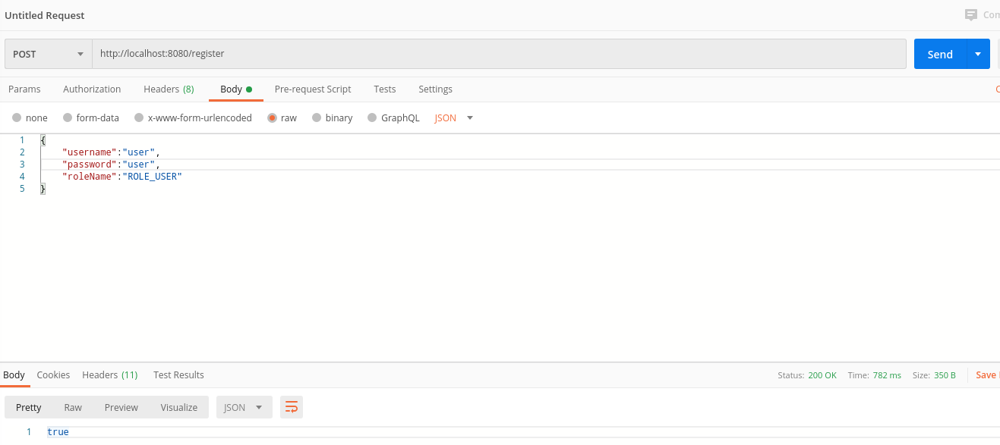
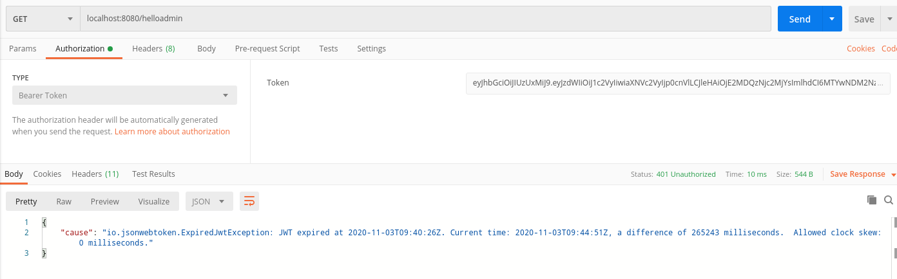
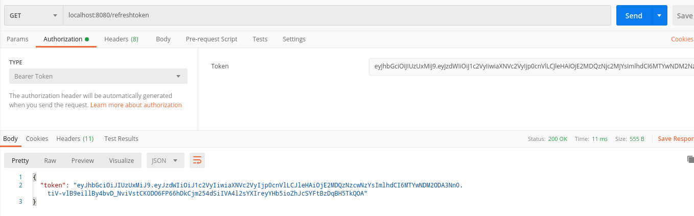

## demo
>springboot springSecurity jwt

### 1 comm user Role

#### 1.1 register

>http://localhost:8080/register

### 1.2  access token

> http://localhost:8080/authenticate

### 1.3 access /hellouser

> localhost:8080/hellouser

### 1.4  access /helloadmin

> localhost:8080/helloadmin

### 1.5  expire test

### 1.6 refresh token

> localhost:8080/refreshtoken

### 1.7 access test

